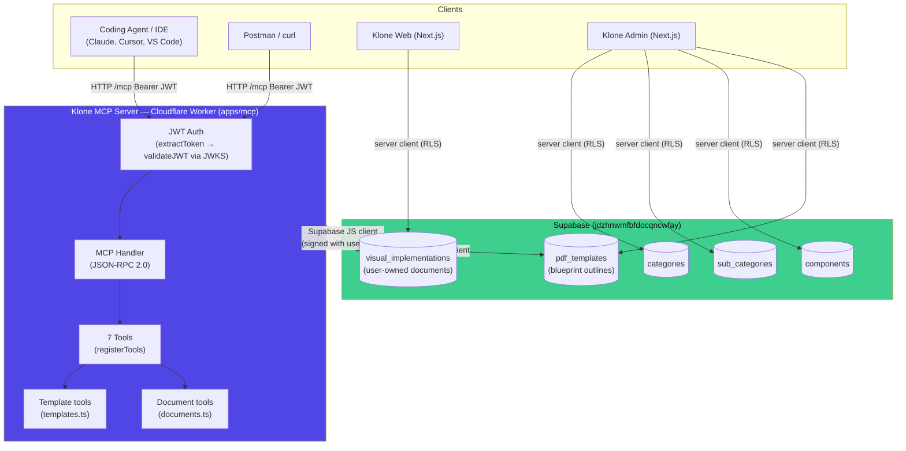
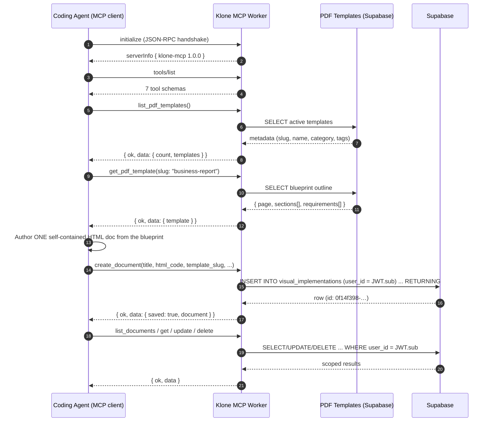
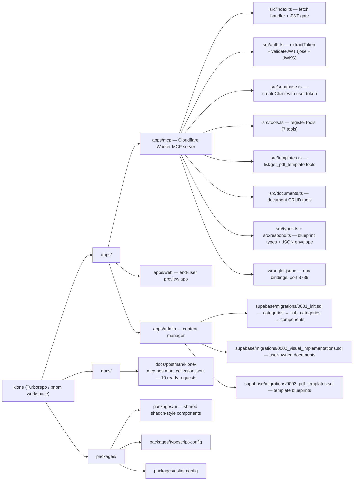
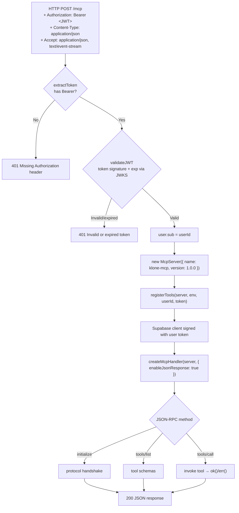
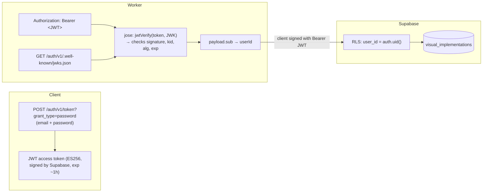
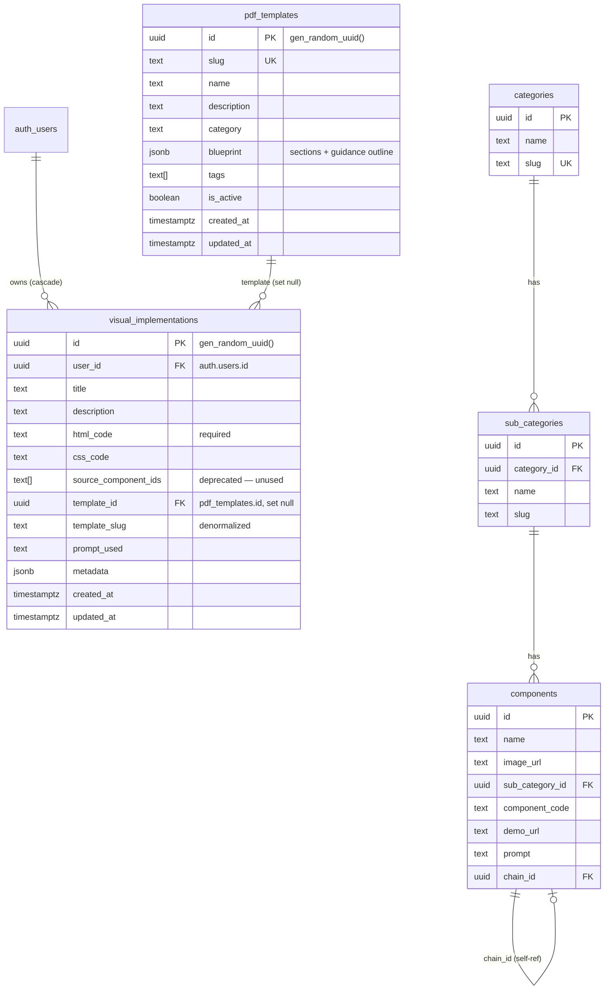
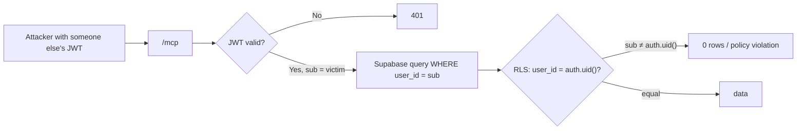

# Klone — PDF Document Generation Platform

> Turn plain task descriptions into **print-ready documents** — a coding agent (Claude, Cursor, any MCP client) fetches a PDF template blueprint through the **Klone MCP server**, authors a self-contained HTML document against it, and saves it under the user's account. The web app then previews, edits, and exports those documents as PDFs.

---

## Table of Contents

1. [What is Klone?](#what-is-klone)
2. [System Architecture](#system-architecture)
3. [The Core Flow (end to end)](#the-core-flow)
4. [Workspace Layout](#workspace-layout)
5. [MCP Server Deep Dive](#mcp-server-deep-dive)
   - [Request Lifecycle](#request-lifecycle)
   - [Authentication](#authentication)
   - [Tool Reference](#tool-reference)
   - [PDF Template Library](#pdf-template-library)
6. [Data Model](#data-model)
7. [Security Model](#security-model)
8. [Running Locally](#running-locally)
9. [Testing with Postman](#testing-with-postman)
10. [Deploying](#deploying)

---

## What is Klone?

Klone is a **PDF document generation platform**. Instead of a coding agent just describing what it built, Klone lets the agent produce a *real, editable document* that a human can open, refine, and export as a PDF.

The one-sentence flow:

```
You (IDE / agent) ──ask──▶ Klone MCP ──gives──▶ PDF template blueprint (outline + guidance)
                                                    │
You (agent) ──author + save──▶ Klone MCP ──writes──▶ Supabase (visual_implementations)
                                                    │
You (human) ──open──▶ Web app ──reads──▶ your saved documents ──▶ preview / edit / export PDF
```

**Three surfaces:**

| Surface | Who uses it | What it does |
|---|---|---|
| **Klone MCP** (`apps/mcp`) | Coding agents & IDEs | Exposes 7 tools: fetch PDF template blueprints, and CRUD the user's saved HTML documents |
| **Klone Web** (`apps/web`) | End users | Template gallery, HTML preview/editor (Figma-style canvas), PDF export |
| **Klone Admin** (`apps/admin`) | Content managers | Manage `pdf_templates` (blueprint outlines) + the legacy `categories → sub_categories → components` taxonomy |

---

## System Architecture



**Key architectural decisions:**

- **Templates in the DB, documents per user** — PDF template blueprints live in `public.pdf_templates` (manageable from the admin app); the documents agents save go to `public.visual_implementations` (per-user, RLS-scoped). PDF rendering stays in the web app (`/api/pdf`) — the worker only stores HTML.
- **Blueprint, not finished HTML** — templates are outlines (page constraints + sections + guidance) that agents follow to author a self-contained HTML document.
- **JSON over SSE** — `createMcpHandler(server, { enableJsonResponse: true })` makes the worker reply with plain JSON-RPC responses, so it works equally well from MCP clients, curl, and Postman.
- **Structured JSON responses** — every tool returns a consistent `{ ok, data }` / `{ ok, error }` envelope so agents can parse results uniformly.
- **User-scoped writes** — every request is authenticated with a Supabase JWT; the server signs its Supabase client with that same token so RLS enforces "users manage own documents".

---

## The Core Flow



---

## Workspace Layout



---

## MCP Server Deep Dive

### Request Lifecycle



### Authentication

Klone reuses **Supabase Auth** as the identity provider — no separate login system.



> ⚠️ **Critical detail (fixed 2026-08-01):** the Supabase client must be created **with the user's JWT**, not just the anon key. `getSupabase(env, token)` sets `global.headers.Authorization`, so Supabase resolves `auth.uid()` correctly. Without it, every write fails with *"new row violates row-level security policy"* because the client looks anonymous.

### Tool Reference

All 7 tools, grouped by purpose. Every tool returns the same structured-JSON envelope — `{ "ok": true, "data": … }` on success, `{ "ok": false, "error": … }` (with `isError`) on failure:

| # | Tool | Args | Returns |
|---|---|---|---|
| 1 | `list_pdf_templates` | `category?`, `query?`, `limit?` | Active template metadata (no blueprint) |
| 2 | `get_pdf_template` ⭐ | `template_id?` or `slug?` | **Main entry** — full blueprint outline (page, sections, requirements) |
| 3 | `create_document` | `title`, `html_code`, `description?`, `template_id?`, `template_slug?`, `prompt_used?`, `metadata?` | Saved document with id |
| 4 | `list_documents` | `limit?`, `offset?` | User's documents, most recently updated first |
| 5 | `get_document` | `id` (uuid) | Single document |
| 6 | `update_document` | `id` + any updatable field | Updated document |
| 7 | `delete_document` | `id` | `{ deleted: true }` |

**The intended agent workflow:**

```
1. list_pdf_templates            → see available blueprint outlines
2. get_pdf_template(slug)        → get page constraints + sections + guidance
3. author the HTML doc from the blueprint
4. create_document(title, html_code, template_slug) → persist under the user
5. list / get / update / delete  → manage saved documents
```

### PDF Template Library

Templates live in `public.pdf_templates` and are managed from the admin app. Each template is a **blueprint outline** — not finished HTML — that guides the agent: page constraints, an ordered list of sections (name, description, guidance per section), and global requirements for the final document.

```json
{
  "version": 1,
  "page": { "format": "A4", "content_width": "794px", "margin": "2.5rem", "body_background": "#ffffff" },
  "sections": [
    {
      "key": "executive-summary",
      "name": "Executive summary",
      "description": "A short overview of the report, its purpose and the key takeaway.",
      "guidance": "Write 3-6 sentences. Use a highlighted callout box with a light background to draw attention.",
      "required": true
    }
  ],
  "requirements": [
    "Self-contained HTML document with embedded <style>",
    "Target content width 794px (A4), renders standalone in an iframe",
    "No external fonts, scripts or network dependencies"
  ]
}
```

**Seeded starter templates** (editable/deletable in the admin app):

| Slug | Category | Use for |
|---|---|---|
| `blank` | General | Anything — the agent structures the document from scratch |
| `business-report` | Reports | Cover, executive summary, findings, data table, recommendations |
| `invoice` | Business | Header, from/to blocks, line items, totals, payment terms |
| `api-docs` | Technical | Overview, auth, endpoints table, request example, error codes |
| `letter` | Business | Sender, date, recipient, salutation, body, signature |

---

## Data Model



**Where data lives today:**

| Data | Location | Notes |
|---|---|---|
| PDF template blueprints | `public.pdf_templates` (Supabase) | Migration `0003_pdf_templates.sql` |
| Saved documents | `public.visual_implementations` (Supabase) | Migrations `0002` + `0003` (template columns) |
| Admin content taxonomy | `categories → sub_categories → components` | Migration `0001_init.sql` exists |

---

## Security Model

- **Every MCP call requires a valid Supabase JWT** (`Authorization: Bearer …`). No token → 401.
- **Tokens are verified with JWKS** (public keys), so no secret validation happens in the worker.
- **RLS is the enforcement point** for the database:
  - `visual_implementations`: `using (user_id = auth.uid()) with check (user_id = auth.uid())` — users can only read/update/delete **their own** rows, even if they forge queries.
  - `categories` / `sub_categories` / `components`: any authenticated user (admin app) has full access.
  - `pdf_templates`: any authenticated user (agents + admin app) has full access.
- **The worker never stores the user's password or long-lived secrets** — only the anon key and JWKS URL are baked into env vars.



---

## Running Locally

**Prerequisites:** Node 20+, pnpm, [wrangler](https://developers.cloudflare.com/workers/wrangler/).

```bash
# 1. Install dependencies (repo root)
pnpm install

# 2. Start the MCP server (port 8789)
cd apps/mcp
pnpm dev          # wrangler dev --port 8789

# 3. (optional) Web app
cd apps/web
pnpm dev

# 4. (optional) Admin app
cd apps/admin
pnpm dev
```

Environment (`apps/mcp/wrangler.jsonc` + `.env.local`):

| Var | Value |
|---|---|
| `SUPABASE_URL` | `https://jdzhnwmfbfdocqncwfay.supabase.co` |
| `SUPABASE_ANON_KEY` | anon JWT |
| `SUPABASE_JWKS_URL` | `…/auth/v1/.well-known/jwks.json` |

Type-check the MCP app:

```bash
cd apps/mcp
pnpm tsc --noEmit
```

---

## Testing with Postman

A ready-made collection is at [`docs/postman/klone-mcp.postman_collection.json`](docs/postman/klone-mcp.postman_collection.json).

**Import:** Postman → Import → select the JSON file.

**How it works out of the box:**

- A **pre-request script** auto-refreshes the Supabase JWT when missing/expired (uses the test user `mcp-test@klone.dev`).
- Request **6 (create_document)** captures the returned id into `{{document_id}}`, so requests 8–10 auto-fill it.
- Base URL is `{{mcp_url}}` → `http://127.0.0.1:8789/mcp`.

**Manual equivalent (curl):**

```bash
# get token
curl -s -X POST "https://jdzhnwmfbfdocqncwfay.supabase.co/auth/v1/token?grant_type=password" \
  -H "apikey: $ANON_KEY" -H "Content-Type: application/json" \
  -d '{"email":"mcp-test@klone.dev","password":"McpTest123!"}'

# call a tool
curl -s -X POST http://127.0.0.1:8789/mcp \
  -H "Authorization: Bearer $TOKEN" \
  -H "Content-Type: application/json" \
  -H "Accept: application/json, text/event-stream" \
  -d '{"jsonrpc":"2.0","id":1,"method":"tools/call","params":{"name":"get_pdf_template","arguments":{"slug":"business-report"}}}'
```

> **Note:** on Windows PowerShell, `·`, `✓`, `★` may render as mojibake (`·`, `â`) in the console — that's a display artifact only; MCP clients receive correct UTF-8.

---

## Deploying

The MCP server deploys as a Cloudflare Worker:

```bash
cd apps/mcp
npx wrangler deploy          # or: pnpm run deploy
```

DB migrations are applied via the Supabase CLI or SQL editor (see `apps/admin/supabase/migrations/`):

```bash
cd apps/admin
supabase db push --db-url "$DATABASE_URL"
```

---

## Roadmap / Next Steps

- [x] MCP server with 7 tools (PDF template blueprints + document CRUD)
- [x] `pdf_templates` table + blueprint outlines + RLS (migration `0003_pdf_templates.sql`)
- [x] `visual_implementations` table + RLS (migration applied)
- [x] JWT-gated auth with user-scoped Supabase client
- [ ] Admin app: manage `pdf_templates` blueprints in the UI
- [ ] Web app: template gallery sourced from `pdf_templates` (currently hardcoded in `apps/web/lib/data/templates.ts`)
- [ ] Support MCP clients without custom header support (e.g. token via env/query param)
