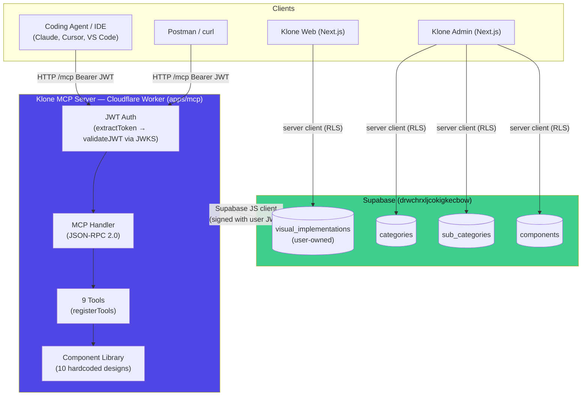
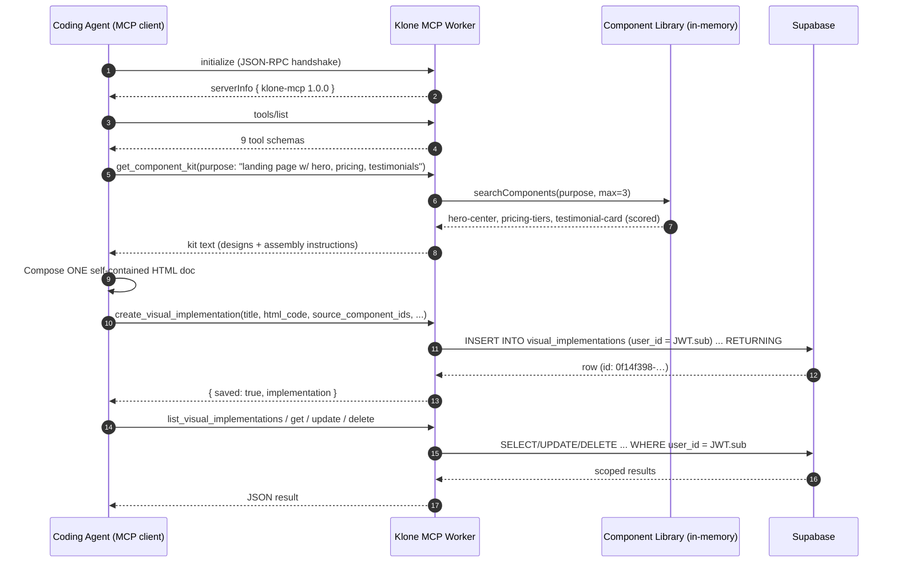
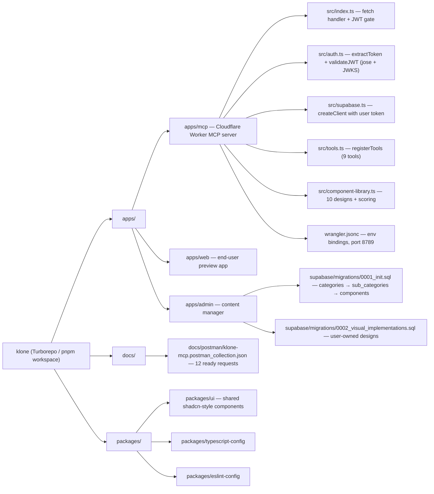
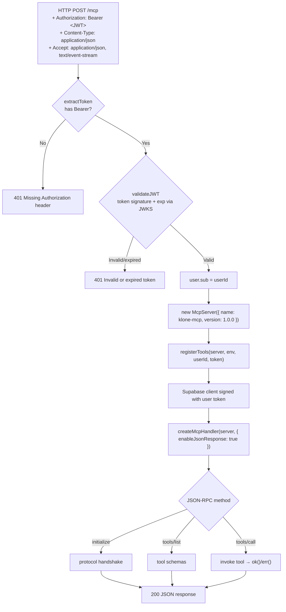
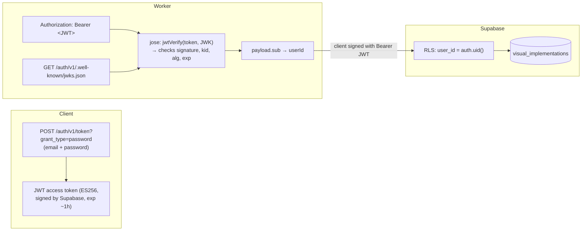
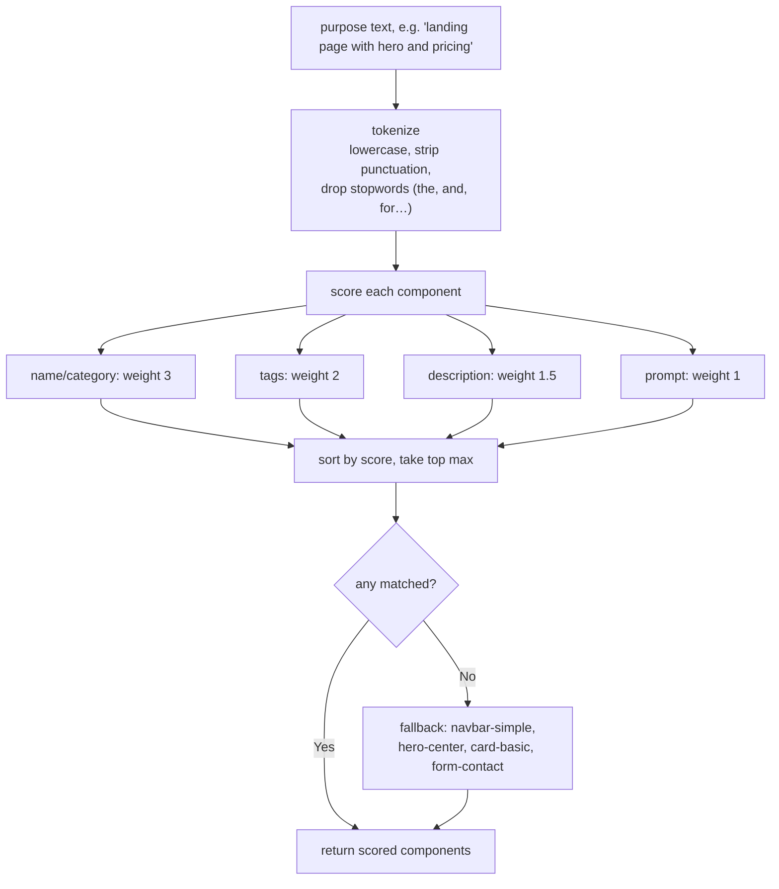
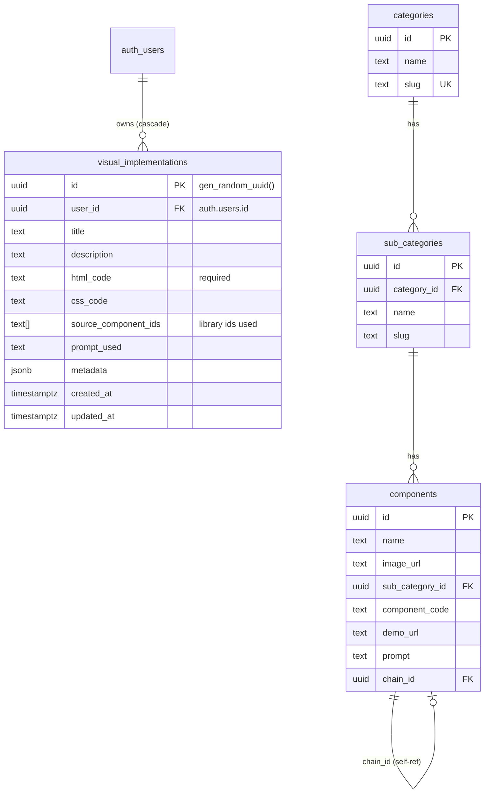
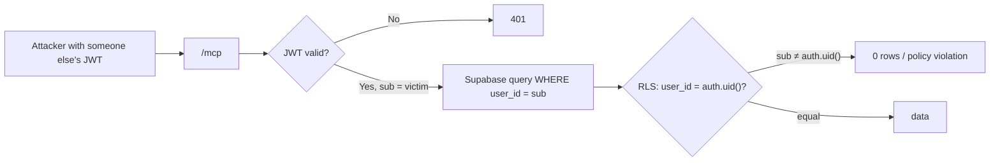

# Klone — Visual Implementation Platform

> Turn plain task descriptions into **reviewable, visual implementations** — a coding agent (Claude, Cursor, any MCP client) fetches curated component designs through the **Klone MCP server**, composes them into a self-contained HTML document, and saves it under the user's account. The web app then previews, edits, and manages those implementations.

---

## Table of Contents

1. [What is Klone?](#what-is-klone)
2. [System Architecture](#system-architecture)
3. [The Core Flow (end to end)](#the-core-flow)
4. [Workspace Layout](#workspace-layout)
5. [MCP Server Deep Dive](#mcp-server-deep-dive)
   - [Request Lifecycle](#request-lifecycle)
   - [Authentication](#authentication)
   - [Tool Reference](#tool-reference)
   - [Component Library](#component-library)
6. [Data Model](#data-model)
7. [Security Model](#security-model)
8. [Running Locally](#running-locally)
9. [Testing with Postman](#testing-with-postman)
10. [Deploying](#deploying)

---

## What is Klone?

Klone is a **visual implementation platform**. Instead of a coding agent just describing what it built, Klone lets the agent produce a *real, rendered design* that a human can open, preview, and iterate on.

The one-sentence flow:

```
You (IDE / agent) ──ask──▶ Klone MCP ──gives──▶ component designs (HTML/CSS)
                                                    │
You (agent) ──compose + save──▶ Klone MCP ──writes──▶ Supabase (visual_implementations)
                                                    │
You (human) ──open──▶ Web app ──reads──▶ your saved implementations ──▶ preview / edit
```

**Three surfaces:**

| Surface | Who uses it | What it does |
|---|---|---|
| **Klone MCP** (`apps/mcp`) | Coding agents & IDEs | Exposes 9 tools: discover component designs, fetch kits, and CRUD saved visual implementations |
| **Klone Web** (`apps/web`) | End users | Template gallery, HTML preview/editor (Figma-style canvas), PDF export |
| **Klone Admin** (`apps/admin`) | Content managers | Manage `categories → sub_categories → components` (DB-driven, for the future dynamic library) |

---

## System Architecture



**Key architectural decisions:**

- **One MCP server, two data sources** — component *designs* are hardcoded in the worker (fast, no DB round-trip); *implementations* are persisted per-user in Supabase. The library can later be swapped for the `components` table without changing the tool surface.
- **JSON over SSE** — `createMcpHandler(server, { enableJsonResponse: true })` makes the worker reply with plain JSON-RPC responses, so it works equally well from MCP clients, curl, and Postman.
- **User-scoped writes** — every request is authenticated with a Supabase JWT; the server signs its Supabase client with that same token so RLS enforces "users manage own implementations".

---

## The Core Flow



---

## Workspace Layout



---

## MCP Server Deep Dive

### Request Lifecycle



### Authentication

Klone reuses **Supabase Auth** as the identity provider — no separate login system.



> ⚠️ **Critical detail (fixed 2026-08-01):** the Supabase client must be created **with the user's JWT**, not just the anon key. `getSupabase(env, token)` sets `global.headers.Authorization`, so Supabase resolves `auth.uid()` correctly. Without it, every write fails with *"new row violates row-level security policy"* because the client looks anonymous.

### Tool Reference

All 9 tools, grouped by purpose:

| # | Tool | Args | Returns |
|---|---|---|---|
| 1 | `list_component_categories` | — | 10 categories with component counts |
| 2 | `list_components` | `category?`, `query?`, `limit?` | Component metadata (no code) |
| 3 | `get_component` | `component_id` | Full design: prompt + HTML code |
| 4 | `get_component_kit` ⭐ | `purpose`, `component_ids?`, `max_components?` | **Main entry** — matched designs + assembly instructions |
| 5 | `create_visual_implementation` | `title`, `html_code`, `description?`, `css_code?`, `source_component_ids?`, `prompt_used?`, `metadata?` | Saved row with id |
| 6 | `list_visual_implementations` | `limit?`, `offset?` | User's implementations, newest first |
| 7 | `get_visual_implementation` | `id` (uuid) | Single implementation |
| 8 | `update_visual_implementation` | `id` + any updatable field | Updated row |
| 9 | `delete_visual_implementation` | `id` | `{ deleted: true }` |

**The intended agent workflow:**

```
1. list_component_categories     → see what exists
2. get_component_kit(purpose)    → get relevant designs + instructions
3. (optional) get_component      → tweak an individual design
4. compose the HTML doc
5. create_visual_implementation  → persist under the user
6. list / get / update / delete  → manage saved designs
```

### Component Library

10 hardcoded designs in `src/component-library.ts`. Each entry is a **self-contained HTML snippet** (inline CSS, zero external dependencies) an agent can drop into a page and adapt.

| Category | Component id | Use for |
|---|---|---|
| Buttons | `btn-basic` | CTAs, submit, primary/secondary/outline/ghost |
| Cards | `card-basic` | Features, articles, gallery items |
| Badges | `badge-status` | Status pills, labels, version tags |
| Navigation | `navbar-simple` | Top navigation with links + CTA |
| Hero | `hero-center` | Opening section of a landing page |
| Forms | `form-contact` | Contact/lead capture forms |
| Pricing | `pricing-tiers` | 3-tier pricing with "Popular" plan |
| Testimonials | `testimonial-card` | Social proof quotes |
| Stats | `stats-band` | Metric counters band |
| Footer | `footer-simple` | Site footer with columns |

**Auto-matching (scored search)** — `searchComponents(purpose, max)`:



---

## Data Model



**Where data lives today:**

| Data | Location | Notes |
|---|---|---|
| Component designs | Hardcoded in `apps/mcp/src/component-library.ts` | Will move to `components` table later |
| Saved implementations | `public.visual_implementations` (Supabase) | ✅ migrated & applied |
| Admin content taxonomy | `categories → sub_categories → components` | Migration `0001_init.sql` exists |

---

## Security Model

- **Every MCP call requires a valid Supabase JWT** (`Authorization: Bearer …`). No token → 401.
- **Tokens are verified with JWKS** (public keys), so no secret validation happens in the worker.
- **RLS is the enforcement point** for the database:
  - `visual_implementations`: `using (user_id = auth.uid()) with check (user_id = auth.uid())` — users can only read/update/delete **their own** rows, even if they forge queries.
  - `categories` / `sub_categories` / `components`: any authenticated user (admin app) has full access.
- **The worker never stores the user's password or long-lived secrets** — only the anon key and JWKS URL are baked into env vars.



---

## Running Locally

**Prerequisites:** Node 20+, pnpm, [wrangler](https://developers.cloudflare.com/workers/wrangler/).

```bash
# 1. Install dependencies (repo root)
pnpm install

# 2. Start the MCP server (port 8789)
cd apps/mcp
pnpm dev          # wrangler dev --port 8789

# 3. (optional) Web app
cd apps/web
pnpm dev

# 4. (optional) Admin app
cd apps/admin
pnpm dev
```

Environment (`apps/mcp/wrangler.jsonc` + `.env.local`):

| Var | Value |
|---|---|
| `SUPABASE_URL` | `https://drwchrxljcokigkecbow.supabase.co` |
| `SUPABASE_ANON_KEY` | anon JWT |
| `SUPABASE_JWKS_URL` | `…/auth/v1/.well-known/jwks.json` |

Type-check the MCP app:

```bash
cd apps/mcp
pnpm tsc --noEmit
```

---

## Testing with Postman

A ready-made collection is at [`docs/postman/klone-mcp.postman_collection.json`](docs/postman/klone-mcp.postman_collection.json).

**Import:** Postman → Import → select the JSON file.

**How it works out of the box:**

- A **pre-request script** auto-refreshes the Supabase JWT when missing/expired (uses the test user `mcp-test@klone.dev`).
- Request **8 (create)** captures the returned id into `{{implementation_id}}`, so requests 10–12 auto-fill it.
- Base URL is `{{mcp_url}}` → `http://127.0.0.1:8789/mcp`.

**Manual equivalent (curl):**

```bash
# get token
curl -s -X POST "https://drwchrxljcokigkecbow.supabase.co/auth/v1/token?grant_type=password" \
  -H "apikey: $ANON_KEY" -H "Content-Type: application/json" \
  -d '{"email":"mcp-test@klone.dev","password":"McpTest123!"}'

# call a tool
curl -s -X POST http://127.0.0.1:8789/mcp \
  -H "Authorization: Bearer $TOKEN" \
  -H "Content-Type: application/json" \
  -H "Accept: application/json, text/event-stream" \
  -d '{"jsonrpc":"2.0","id":1,"method":"tools/call","params":{"name":"get_component_kit","arguments":{"purpose":"a landing page","max_components":2}}}'
```

> **Note:** on Windows PowerShell, `·`, `✓`, `★` may render as mojibake (`·`, `â`) in the console — that's a display artifact only; MCP clients receive correct UTF-8.

---

## Deploying

The MCP server deploys as a Cloudflare Worker:

```bash
cd apps/mcp
npx wrangler deploy          # or: pnpm run deploy
```

DB migrations are applied via the Supabase CLI or SQL editor (see `apps/admin/supabase/migrations/`):

```bash
cd apps/admin
supabase db push --db-url "$DATABASE_URL"
```

---

## Roadmap / Next Steps

- [x] MCP server with 9 tools (component discovery + implementation CRUD)
- [x] Hardcoded component library (10 designs)
- [x] `visual_implementations` table + RLS (migration applied)
- [x] JWT-gated auth with user-scoped Supabase client
- [ ] Move component designs from code → `components` table
- [ ] Web app: list/render saved implementations from `visual_implementations`
- [ ] Support MCP clients without custom header support (e.g. token via env/query param)
